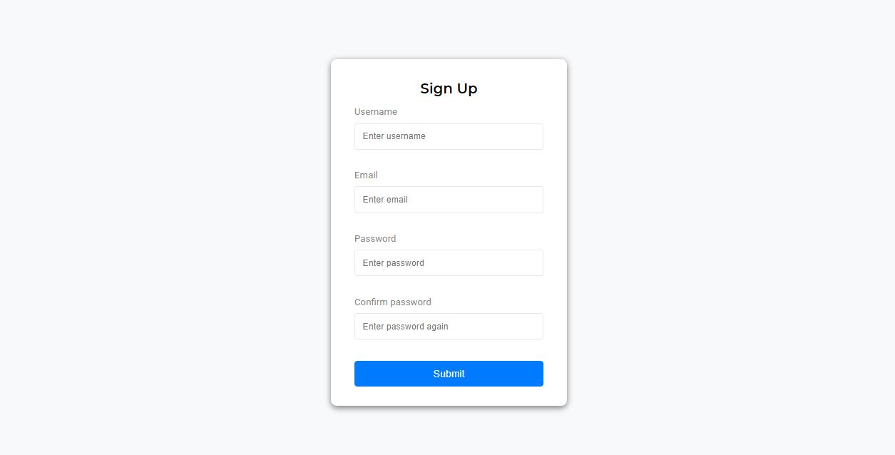

## form-validator

This is a client-side form validator build with vanilla JavaScript. It checks the required entries, the specific __length__ of entries, email and password match using regular expressions.

## Projects specifications

- Create a form UI using HTML and CSS
- Add an error message `<small></small>` under specific inputs
- __`displayError()`__ and __`displaySuccess()`__ for changing colors on inputs
- __`checkRequired()`__ to check if the inputs should be filled with value
- __`checkUsername()`__ to check if the username contains only valid characters and in range of 5, 30.
- __`checkEmail()`__ to check if the email contains only valid characters and in range 7, 254.
- __`checkPassword()`__ to check if the password contains all needed characters small and capital letter and digits and length respected.
- __`checkPasswordsMatch()`__ to check if two entered passwords matches
- An event listener to validate the form before it's submitted

This is a cool projects that can teach the usage of `RegExp()` JavaScript object.

If you want to see the live demo of the project, click [https://sam0132nodier.github.io/form-validator](https://sam0132nodier.github.io/form-validator).
